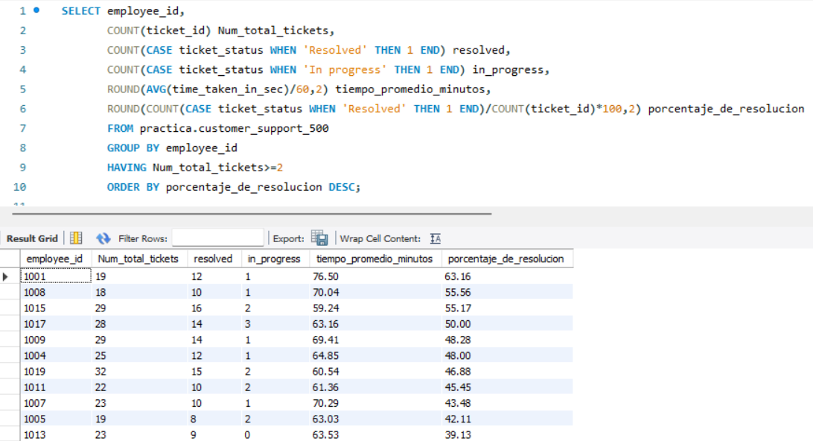

# Customer Support Analysis | SQL

## 📌 Descripción del proyecto

Proyecto práctico de análisis de datos enfocado en la gestión de tickets de atención al cliente.

Utilizando MySQL, desarrollé una consulta para analizar el volumen de tickets asignados a cada empleado, calcular indicadores de resolución y examinar los tiempos promedio de gestión.

El análisis utiliza una base de datos de práctica con 500 registros.

## 🎯 Objetivo

Construir indicadores que permitan responder a las siguientes preguntas:

* ¿Cuántos tickets tiene asignados cada empleado?
* ¿Cuántos tickets están resueltos y cuántos permanecen en progreso?
* ¿Cuál es el tiempo medio de gestión?
* ¿Qué porcentaje de los tickets asignados se encuentra resuelto?

## 🛠️ Herramientas utilizadas

* MySQL
* MySQL Workbench
* SQL

**Funciones y cláusulas aplicadas:**

`SELECT`, `COUNT()`, `CASE`, `AVG()`, `ROUND()`, `GROUP BY`, `HAVING` y `ORDER BY`.

## 📊 Metodología

**1. Agrupación por empleado**

Se utilizó `GROUP BY employee_id` para obtener una fila por cada empleado.

**2. Cálculo de tickets por estado**

Mediante `COUNT()` y `CASE` se contabilizaron únicamente los registros correspondientes a los estados `Resolved` e `In progress`.

**3. Cálculo del tiempo promedio**

Se utilizó `AVG()` para calcular el tiempo medio de gestión de todos los tickets asignados a cada empleado. El resultado se convirtió de segundos a minutos y se redondeó a dos decimales.

**4. Porcentaje de resolución**

Se calculó dividiendo el número de tickets con estado `Resolved` entre el total de tickets asignados y multiplicando por 100.

**5. Filtrado y ordenación**

Se utilizó `HAVING` para incluir únicamente empleados con dos o más tickets y `ORDER BY` para ordenar los resultados por porcentaje de resolución descendente.

## 🔎 Principales resultados

Según los resultados obtenidos en la práctica:

| Empleado | Tickets | Resueltos | Tiempo medio (min) | Resolución |
| -------- | ------: | --------: | -----------------: | ---------: |
| 1001     |      19 |        12 |              76,50 |    63,16 % |
| 1008     |      18 |        10 |              70,04 |    55,56 % |
| 1015     |      29 |        16 |              59,24 |    55,17 % |

Los resultados permiten comparar el volumen de tickets y los indicadores de resolución y tiempo de gestión por empleado.

El porcentaje de resolución considera exclusivamente el estado `Resolved`. El tiempo medio incluye todos los estados.

*Los valores corresponden a datos de práctica y no representan resultados operativos de una empresa real.*

## 💡 Aprendizajes

Este ejercicio me permitió reforzar el uso de agregaciones y lógica condicional en SQL para construir indicadores operativos.

También aprendí a combinar métricas de volumen, estado y tiempo en una única consulta, facilitando la elaboración de informes de seguimiento.

## 🚀 Próximos pasos

* Ampliar el análisis con indicadores adicionales.
* Exportar los resultados a Excel.
* Crear un dashboard interactivo en Power BI.

---

**Proyecto desarrollado como parte de mi aprendizaje y transición profesional hacia el análisis de datos y Business Intelligence.**

## 📊 Resultados de la consulta

