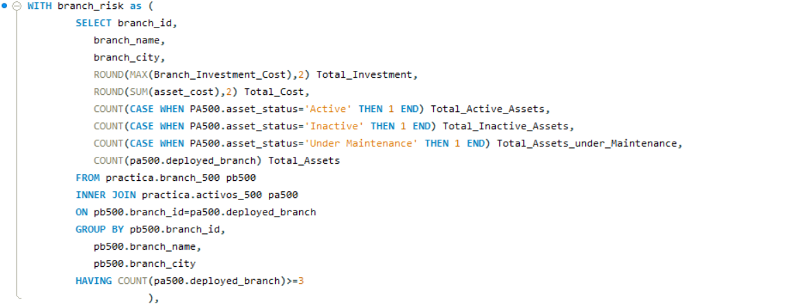
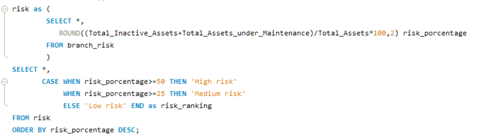

# Branch Asset Risk Analysis | SQL

## 📌 Project Overview

SQL project focused on analyzing branch asset conditions and identifying operational risk based on asset status.

The analysis combines branch and asset data to calculate the proportion of assets that are either inactive or under maintenance.

## 🎯 Objective

The goal of this project is to:

- Analyze assets by branch.
- Count active, inactive and under-maintenance assets.
- Calculate total asset cost.
- Review branch investment.
- Calculate a branch risk percentage.
- Classify each branch as High, Medium or Low risk.

## 🛠️ Tools & SQL Concepts

- MySQL
- MySQL Workbench
- CTEs (`WITH`)
- `INNER JOIN`
- `COUNT()`
- `SUM()`
- `MAX()`
- `ROUND()`
- `CASE`
- `GROUP BY`
- `HAVING`
- `ORDER BY`

## 📊 Risk Logic

The risk percentage is calculated as:

```sql
(Inactive Assets + Assets Under Maintenance)
/
Total Assets * 100

Branches are classified as:

- **High risk:** 50% or more
- **Medium risk:** 25% to 49.99%
- **Low risk:** below 25%

## 🧠 Query Structure

The query uses two chained CTEs:

### 1. `branch_risk`

This first CTE aggregates branch and asset information, including:

- total active assets
- total inactive assets
- assets under maintenance
- total assets
- total asset cost
- branch investment

### 2. `risk`

The second CTE uses the results from `branch_risk` to calculate the risk percentage for each branch.

The final `SELECT` uses a `CASE` statement to classify each branch according to its risk level.

## 📷 SQL Query

### Part 1



### Part 2



## 💡 What I Learned

This exercise helped me better understand how chained CTEs can simplify complex SQL queries.

Instead of repeating long aggregate expressions, I created intermediate results that could be reused in later calculations.

It also helped me practice how to transform operational data into business indicators that can support reporting and decision-making.

---

Practice project developed as part of my Data Analytics and Business Intelligence learning journey.


