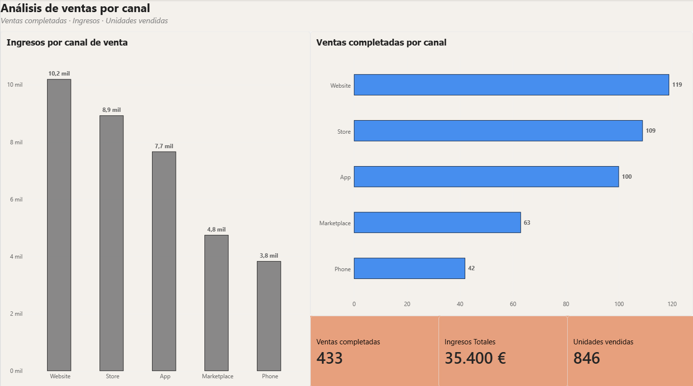

# Análisis de ventas por canal | SQL + Power BI



## Descripción del proyecto

Este proyecto analiza las ventas completadas por canal utilizando MySQL, SQL y Power BI.

El objetivo es identificar qué canales de venta generan mayores ingresos, mayor número de ventas completadas y más unidades vendidas.

El análisis parte de una tabla de ventas con 500 registros. Primero se realiza el filtrado y la agregación de los datos mediante SQL y posteriormente se utiliza Power BI para construir un dashboard interactivo y facilitar la interpretación de los resultados.

## Herramientas utilizadas

- MySQL
- MySQL Workbench
- SQL
- Power BI
- DAX

## Análisis con SQL

Para el análisis se filtraron únicamente los pedidos cuyo estado era `completed`.

Posteriormente se agruparon los resultados por canal de venta para calcular:

- Número de ventas completadas.
- Total de unidades vendidas.
- Ingresos totales generados por cada canal.

```sql
SELECT 
    sales_channel,
    COUNT(*) AS ventas_completadas,
    SUM(quantity) AS unidades_vendidas,
    SUM(revenue) AS ingresos_totales
FROM sql_powerbi_practice.sales_500
WHERE order_status = 'completed'
GROUP BY sales_channel;
