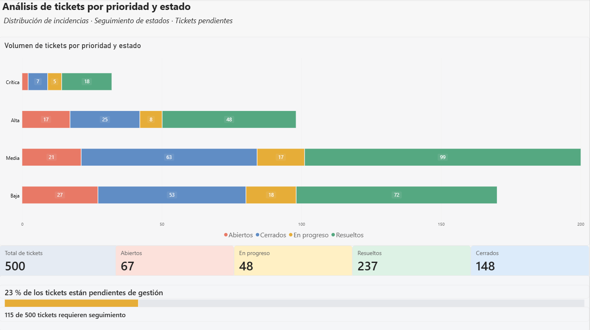

# 📊 Análisis de tickets por prioridad y estado | SQL + Power BI



## Descripción del proyecto

Proyecto práctico de análisis de 500 tickets de soporte utilizando MySQL, SQL, Power Query, DAX y Power BI.

El objetivo es estudiar la distribución de incidencias por prioridad y estado, identificar tickets pendientes de gestión y facilitar el seguimiento operativo mediante indicadores.

## Herramientas utilizadas

- MySQL y MySQL Workbench
- SQL
- Power Query
- Power BI
- DAX

## Análisis con SQL

Se agruparon los tickets por prioridad y estado utilizando `COUNT(*)` y `GROUP BY`.

```sql
SELECT
    priority,
    ticket_status,
    COUNT(*) AS total_tickets
FROM sql_powerbi_practice.support_tickets_500
GROUP BY priority, ticket_status
ORDER BY total_tickets DESC;
```

## Transformación de datos con Power Query

- Traducción de las prioridades al español.
- Traducción de los estados de los tickets.
- Creación de una columna condicional para ordenar las prioridades: Crítica, Alta, Media y Baja.
- Preparación de los datos para su visualización.

## Dashboard en Power BI

Se desarrolló un dashboard que incluye:

- Gráfico de barras apiladas por prioridad y estado.
- Cinco tarjetas KPI de gestión de tickets.
- Indicadores dinámicos de tickets pendientes.
- Medidas DAX para calcular el número y porcentaje de tickets pendientes.
- Barra de progreso para visualizar el porcentaje pendiente.

## Principales resultados

| Indicador | Resultado |
|---|---:|
| Total de tickets | 500 |
| Abiertos | 67 |
| En progreso | 48 |
| Resueltos | 237 |
| Cerrados | 148 |
| Pendientes de gestión | 115 |
| Porcentaje pendiente | 23 % |

## Conclusiones

- La prioridad Media concentra 200 tickets, equivalentes al 40 % del total.
- El 23 % de los tickets permanece abierto o en progreso.
- El dashboard facilita la identificación de cargas de trabajo y el seguimiento de incidencias por estado y prioridad.

## Competencias practicadas

SQL · Power Query · DAX · Power BI · Reporting · KPIs · Visualización de datos · Análisis operativo

## Nota

Los datos utilizados son ficticios y se emplean exclusivamente con fines de práctica y aprendizaje.
