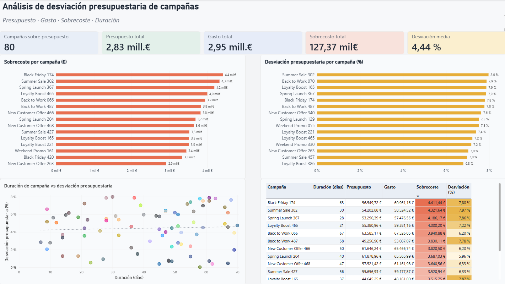

# 📊 Análisis de desviación presupuestaria de campañas | SQL + Power BI



## Descripción del proyecto

Proyecto práctico de análisis de campañas de marketing utilizando MySQL, SQL, Power Query y Power BI.

El objetivo es identificar campañas que superaron su presupuesto, analizar la magnitud del sobrecoste, medir la desviación porcentual y estudiar si existe alguna relación entre la duración de la campaña y el nivel de desviación presupuestaria.

## Herramientas utilizadas

- MySQL
- MySQL Workbench
- SQL
- Power Query
- Power BI
- DAX

## Análisis con SQL

Se filtraron únicamente las campañas cuyo gasto superó el presupuesto.

También se calcularon:

- Duración de la campaña en días.
- Sobrecoste absoluto.
- Porcentaje de desviación presupuestaria.

```sql
SELECT
    campaign_name,
    DATEDIFF(end_date, start_date) AS duracion_dias,
    budget,
    spend,
    spend - budget AS diferencia_presupuesto,
    ROUND((spend - budget) / budget * 100, 2) AS porcentaje_desviacion
FROM marketing_campaigns_500
WHERE spend > budget
ORDER BY diferencia_presupuesto DESC;
```

## Transformación en Power BI

Para la visualización, el porcentaje de desviación se adaptó en Power Query para trabajar correctamente con el formato de porcentaje de Power BI.

Además, se prepararon los datos para mostrar:

- Rankings de campañas.
- Indicadores KPI.
- Relación entre duración y desviación.
- Tabla detallada con formato condicional.

## Dashboard

El dashboard incluye:

- 5 tarjetas KPI.
- Top 15 campañas con mayor sobrecoste.
- Top 15 campañas con mayor desviación porcentual.
- Gráfico de dispersión entre duración y desviación presupuestaria.
- Línea de tendencia.
- Tabla Top 15 con formato condicional.

## Principales resultados

| Indicador | Resultado |
|---|---:|
| Campañas sobre presupuesto | 80 |
| Presupuesto total | 2,83 M € |
| Gasto total | 2,95 M € |
| Sobrecoste total | 127,37 mil € |
| Desviación media | 4,44 % |

## Hallazgos destacados

- Black Friday 174 presenta el mayor sobrecoste absoluto.
- Summer Sale 302 presenta una de las mayores desviaciones porcentuales.
- El sobrecoste total de las campañas analizadas supera los 127 mil €.
- La línea de tendencia muestra una relación débil entre la duración de las campañas y la desviación presupuestaria.

## Competencias practicadas

SQL · Power BI · Power Query · DAX · Data Analytics · Business Intelligence · Visualización de datos · Reporting · KPIs · Análisis de marketing

## Nota

Los datos utilizados son ficticios y se emplean exclusivamente con fines de práctica y aprendizaje.
