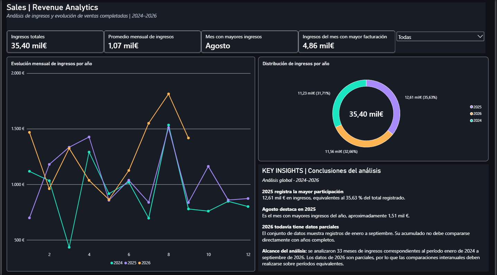

# 📊 Proyecto 09 | Análisis de ingresos por ventas

## 🎯 Objetivo del proyecto

Analizar la evolución de los ingresos procedentes de ventas completadas durante el período comprendido entre enero de 2024 y septiembre de 2026, utilizando **MySQL, Power BI y DAX**.

El objetivo es identificar tendencias mensuales, comparar los ingresos de diferentes años y desarrollar indicadores dinámicos que faciliten la interpretación de los resultados.

---

## 🛠️ Herramientas utilizadas

- **MySQL:** extracción y agrupación de datos.
- **SQL:** YEAR(), MONTH(), SUM(), WHERE, GROUP BY y ORDER BY.
- **Power BI:** creación de dashboards interactivos.
- **DAX:** medidas dinámicas para el análisis de ingresos.
- **Visualización de datos:** gráficos de líneas, gráficos de dona y tarjetas KPI.

---

## 🗂️ Dataset

Se utilizó la tabla `sales_500`, perteneciente a la base de datos `sql_powerbi_practice`.

El análisis considera exclusivamente las ventas cuyo estado es `completed`.

### Período analizado

- **2024:** 12 meses.
- **2025:** 12 meses.
- **2026:** 9 meses (enero a septiembre).
- **Total:** 33 períodos mensuales registrados.

**Nota:** Los datos de 2026 son parciales. Las comparaciones interanuales deben considerar períodos equivalentes.

---

## 💻 Consulta SQL

```sql
SELECT
    YEAR(sale_date) AS año,
    MONTH(sale_date) AS mes,
    SUM(revenue) AS total_ingreso
FROM sql_powerbi_practice.sales_500
WHERE order_status = 'completed'
GROUP BY año, mes
ORDER BY año ASC, mes ASC;
```

### Explicación de la consulta

1. `YEAR()` extrae el año de cada venta.
2. `MONTH()` identifica el mes correspondiente.
3. `SUM()` calcula los ingresos totales.
4. `WHERE` filtra únicamente las ventas completadas.
5. `GROUP BY` agrupa los resultados por año y mes.
6. `ORDER BY` organiza los resultados cronológicamente.

---

## 📈 Dashboard | Sales Revenue Analytics

Se desarrolló un dashboard interactivo en Power BI para visualizar los ingresos y analizar su evolución temporal.

### Indicadores KPI

- **Ingresos totales:** suma de los ingresos registrados.
- **Promedio mensual:** media de ingresos de los períodos mensuales disponibles.
- **Mes con mayores ingresos:** identifica dinámicamente el mes con mayor facturación.
- **Ingresos del mejor mes:** calcula el importe correspondiente al mes de mayor facturación.

### Visualizaciones

- **Gráfico de líneas:** compara los ingresos mensuales de 2024, 2025 y 2026.
- **Gráfico de dona:** representa la participación de cada año en los ingresos totales.
- **Segmentador por año:** permite actualizar los indicadores y la evolución mensual.
- **Key Insights:** sección con las principales conclusiones del análisis.

### Vista previa del dashboard



---

## 🧮 Medidas DAX utilizadas

### 1. Promedio mensual de ingresos

```dax
Promedio Mensual =
AVERAGE('Consulta'[total_ingreso])
```

Calcula los ingresos promedio de los períodos mensuales registrados y responde a los filtros aplicados.

### 2. Mes con mayores ingresos

```dax
Mes Mayor Ingreso =
VAR MejorMes =
    TOPN(
        1,
        SUMMARIZE(
            'Consulta',
            'Consulta'[mes],
            "Ingresos", SUM('Consulta'[total_ingreso])
        ),
        [Ingresos], DESC,
        'Consulta'[mes], ASC
    )
RETURN
    MAXX(MejorMes, 'Consulta'[mes])
```

Identifica el número del mes que acumula mayores ingresos dentro del contexto de filtros.

### 3. Nombre del mes con mayores ingresos

```dax
Nombre Mes Mayor Ingreso =
VAR NumeroMes = [Mes Mayor Ingreso]
VAR NombreMes =
    FORMAT(DATE(2026, NumeroMes, 1), "MMMM", "es-ES")
RETURN
    IF(
        ISBLANK(NumeroMes),
        BLANK(),
        UPPER(LEFT(NombreMes, 1))
            & MID(NombreMes, 2, LEN(NombreMes))
    )
```

Convierte el número del mes en su nombre en español, con la primera letra en mayúscula.

### 4. Ingresos del mejor mes

```dax
Ingreso Mejor Mes =
VAR MesGanador = [Mes Mayor Ingreso]
RETURN
    CALCULATE(
        SUM('Consulta'[total_ingreso]),
        'Consulta'[mes] = MesGanador
    )
```

Calcula los ingresos correspondientes al mes con mayor facturación, respetando los filtros del informe.

---

## 🔎 Principales resultados

| Indicador | Resultado |
|---|---|
| Períodos mensuales analizados | 33 |
| Ingresos totales | 35,40 mil € |
| Promedio por período mensual | 1,07 mil € |
| Año con mayor participación | 2025 |
| Participación de 2025 | 35,63 % |
| Ingresos de 2025 | 12,61 mil € |
| Mes con mayor ingreso acumulado | Agosto |
| Ingresos acumulados de agosto | 4,86 mil € |

### Distribución de ingresos por año

| Año | Ingresos aproximados | Participación |
|---|---:|---:|
| 2024 | 11,23 mil € | 31,71 % |
| 2025 | 12,61 mil € | 35,63 % |
| 2026 | 11,56 mil € | 32,66 % |
| **Total** | **35,40 mil €** | **100 %** |

---

## 💡 Key Insights | Conclusiones del análisis

### 1. El año 2025 registra la mayor participación

2025 representa el **35,63 % de los ingresos totales**, con aproximadamente 12,61 mil € registrados.

### 2. Agosto destaca como el mes con mayor facturación acumulada

Al agrupar los ingresos de los diferentes años por mes, agosto registra aproximadamente **4,86 mil €**.

### 3. Los datos de 2026 son parciales

Mientras 2024 y 2025 cuentan con doce meses registrados, 2026 dispone de nueve.

Por este motivo, no resulta adecuado comparar directamente los ingresos acumulados de 2026 con los totales anuales de los otros años sin ajustar los períodos.

### 4. Importancia del análisis interactivo

El uso de filtros permite analizar los ingresos de cada año y observar cómo cambian los indicadores mensuales.

Esto facilita la identificación de tendencias y el análisis de períodos concretos.

---

## 🚀 Aprendizajes

Este proyecto me permitió reforzar conocimientos en:

- Consultas SQL con agrupaciones temporales.
- Funciones de agregación y filtrado de datos.
- Creación de dashboards interactivos en Power BI.
- Desarrollo de medidas DAX dinámicas.
- Configuración de interacciones entre visualizaciones.
- Análisis de tendencias y distribución de ingresos.
- Interpretación de indicadores de negocio.
- Comunicación de conclusiones basadas en datos.

---

**Proyecto desarrollado como parte de mi portfolio de análisis de datos y Business Intelligence.**
